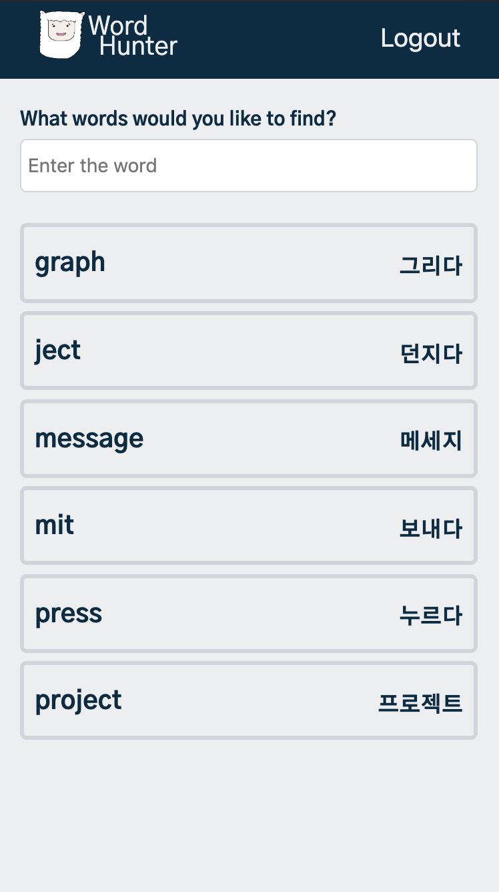

# Word hunter

## 1. Introduce

Word hunter is a service to help memorize English words.  
I have not uploaded it to the server yet, but I will uploaded it to AWS.

Front-end : Vue.js  
Back-end : Node.js(Express.js)  

## 3. How to use

If you want to run this project, you need something first.  

1. Install node & npm
2. Install MongoDB & Setting MongoDB admin acount
3. Install pm2

If all is done, follow the next steps.

1. Git clone
2. cd client
3. npm install & npm run build
4. cd server
5. Follow the config-example.js and write a your config.js
6. npm install &  & npm start

## 4. Screen Capture

### 1. Login & Sign up

### 2. Main

### 3. Word registration & list

### 4. Word training

